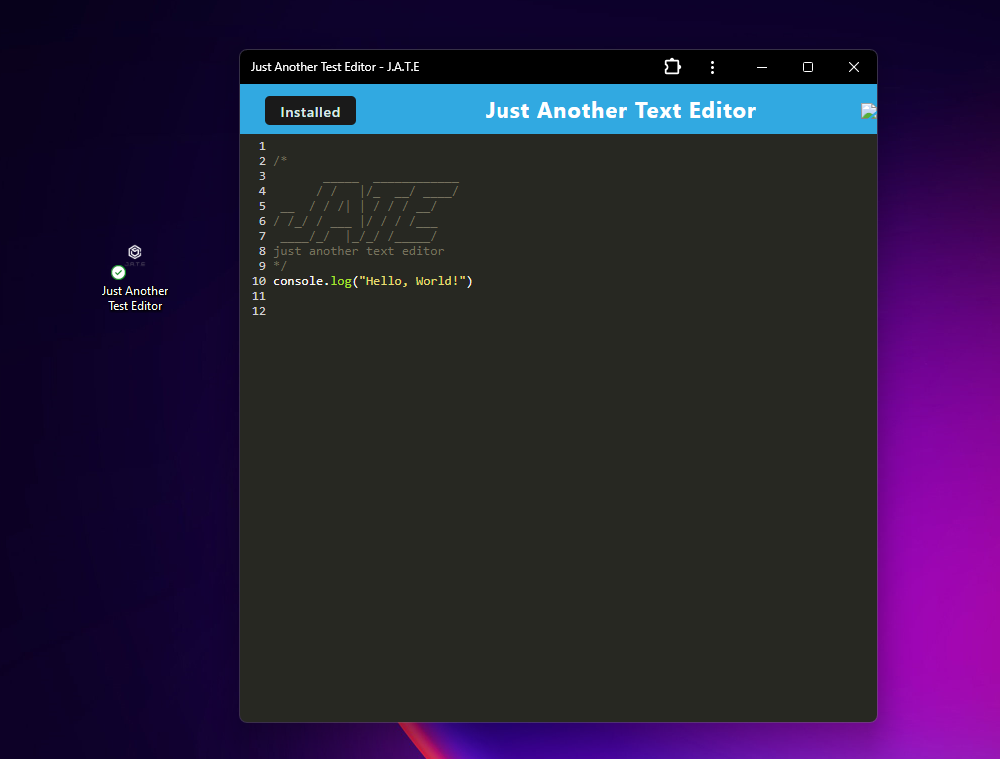

# Text Editor Web Application

This web application allows users to create and store notes or code snippets with or without an internet connection. The application features a text editor with offline capabilities, ensuring reliable access to content for later use.

- [Text Editor](https://still-ocean-20491-3dee56b86f9e.herokuapp.com/)

## Installation

1. Clone the repository
2. Navigate to the project directory
3. Install dependencies: **npm install**

## Usage
To start the application and serve both the backend and client, run: **npm run start**

This command will initiate the backend server and serve the client application.

To bundle JavaScript files using webpack, run: **npm run build**

This command will generate HTML, service worker, and manifest files, optimizing the application for production.

### Using Next-gen JavaScript
The application supports next-gen JavaScript features. Write modern JavaScript code, and webpack will transpile it for compatibility.

### IndexedDB Storage
Upon opening the text editor, IndexedDB immediately creates a database storage. Enter content in the editor, click off the window, and the content will be saved in IndexedDB.

### Installing the Application
Clicking on the "Install" button allows users to download the web application as an icon on their desktop, enhancing accessibility.

## Built With
- Webpack - Module bundler
- Babel - JavaScript compiler
- IndexedDB - Browser-based database
- Workbox - JavaScript library for Progressive Web Apps

### Screenshot

### Contact Creator
- [Emily's GitHub](https://github.com/mLek10/Text-Editor-PWA)
- [Emily's Email](caton.emily@yahoo.com)